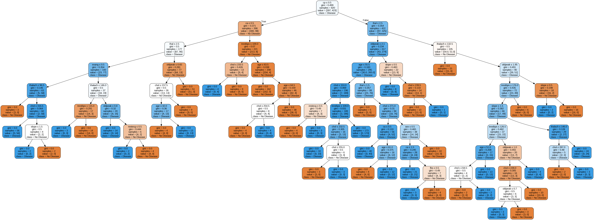
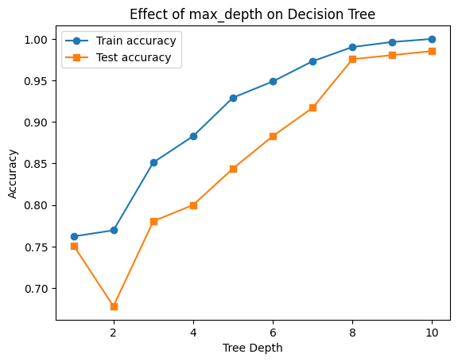
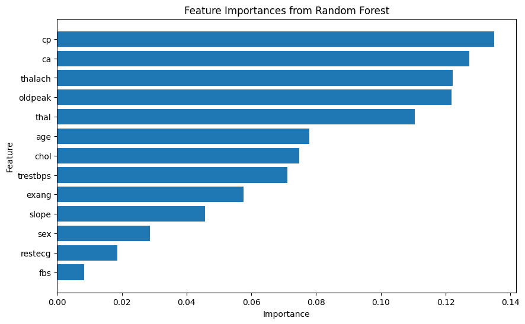

# 🌳 Task 5: Decision Trees and Random Forests - Heart Disease Classification

## 📌 Objective

The goal of this task is to **implement and understand decision trees and random forests** for classifying heart disease presence using a medical dataset. You will explore tree-based models, their interpretability, and their ability to generalize.

---

## 🛠 Tools & Libraries Used

- Python
- Pandas
- NumPy
- Matplotlib
- Scikit-learn
- Graphviz

---

## 📂 Dataset

Dataset: [`heart.csv`](heart.csv)  
Source: [Kaggle - Heart Disease Dataset](https://www.kaggle.com/datasets/johnsmith88/heart-disease-dataset)

**Target Variable**: `target`  
- `1` = Heart Disease Present  
- `0` = No Heart Disease

---

## 🧪 Steps Performed

1. **Data Loading & Cleaning**  
   - Loaded the CSV data with Pandas  
   - Checked for null values and cleaned data if required

2. **Train-Test Split**  
   - 80% train, 20% test  
   - Random seed 42 for reproducibility

3. **Decision Tree Classifier**  
   - Trained a fully grown tree  
   - Visualized with Graphviz  
   - Evaluated accuracy on training and test sets  
   - Analyzed overfitting with various `max_depth` values

4. **Random Forest Classifier**  
   - Trained a random forest with 100 estimators  
   - Compared its accuracy to the decision tree

5. **Feature Importance**  
   - Used random forest's `feature_importances_` to rank features

6. **Cross-Validation**  
   - Used 5-fold cross-validation to evaluate the random forest

---

## 📊 Results

### 1️⃣ Decision Tree Visualization

> *decision_tree_heart.png saved and shown below (rendered by Graphviz)*

---

### 2️⃣ Analyze Overfitting and Control Tree Depth

Below plot shows how the unrestricted tree overfits, while limiting `max_depth` improves generalization:

- Deeper trees achieved near 100% train accuracy, but test accuracy only stabilized around depth 6–8.  
- Best generalization around `max_depth=4` to `max_depth=6`.

---

### 3️⃣ Feature Importance

Random Forest ranked features as follows:

> Chest pain type (`cp`), number of vessels (`ca`), and maximum heart rate (`thalach`) were most important for predicting heart disease.

---

### 4️⃣ Cross-Validation Results

| Fold | Accuracy |
|------|----------|
| 1    | 1.000    |
| 2    | 1.000    |
| 3    | 1.000    |
| 4    | 1.000    |
| 5    | 0.985    |

**Mean CV Accuracy**: 0.997

---

## 🔍 Key Learnings

- Decision trees are easy to interpret but can overfit  
- Controlling `max_depth` helps improve generalization  
- Random forests combine many trees for more robust performance  
- Feature importance in ensembles gives insight into the most predictive variables  
- Cross-validation is essential for robust model evaluation

